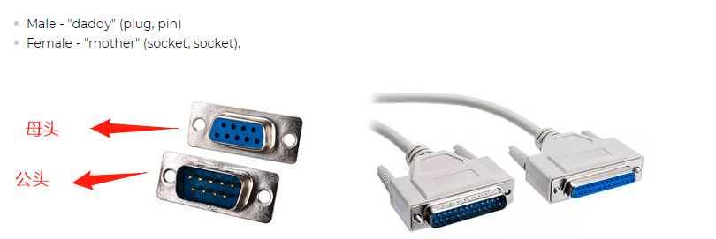
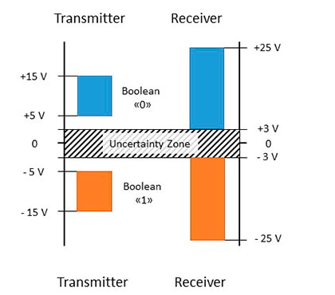
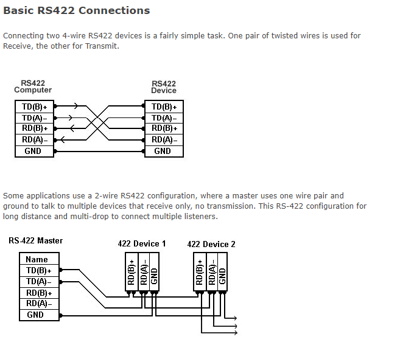
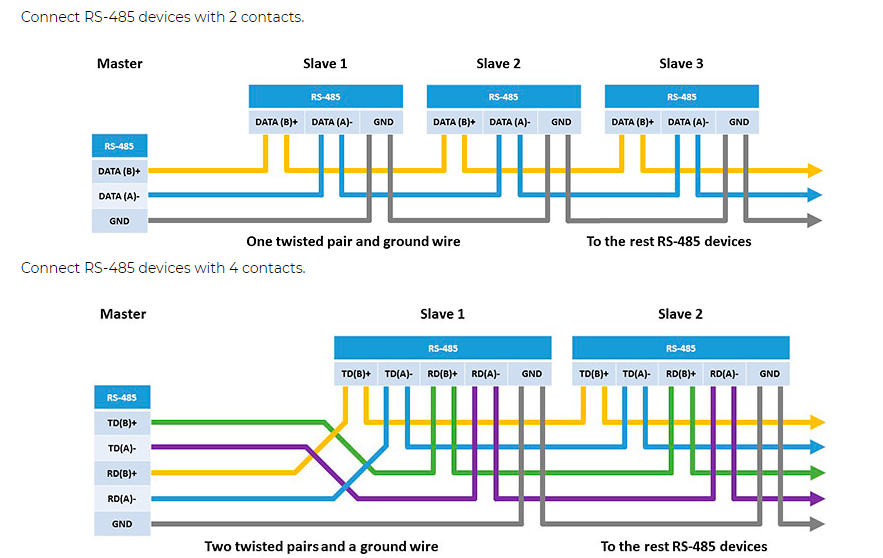

## # 232-422-485

参考链接：[The main differences between RS-232, RS-422 and RS-485](https://ipc2u.com/articles/knowledge-base/the-main-differences-between-rs-232-rs-422-and-rs-485/)

422、485工业上用的比较多，电脑的com口是232的，很久之前接鼠标、键盘、打印机都用这种

## 主要区别

| Port name                        | RS-232                                  | RS-422                         | RS-485                                        |
| -------------------------------- | --------------------------------------- | ------------------------------ | --------------------------------------------- |
| Transfer type                    | Full duplex                             | Full duplex                    | Half duplex (2 wires), full duplex (4 wires)  |
| Maximum distance                 | 15 meters at 9600 bps                   | 1200 meters at 9600 bps        | 1200 meters at 9600 bps                       |
| Contacts in use                  | TxD, RxD, RTS, CTS, DTR, DSR, DCD, GND* | TxA, TxB, RxA, RxB, GND        | DataA, DataB, GND                             |
| Topology                         | Point-to-Point                          | Point-to-Point                 | Multi-point                                   |
| Max. Number of connected devices | 1                                       | 1 (10 devices in receive mode) | 32 (with repeaters larger, usually up to 256) |

Full duplex 全双工 同时收发

Half duplex 半双工  收时不能发，发时不能收

## 公头母头

## 232

电压：

- he logical "1" (MARK) corresponds to a voltage in the range from -3 to -15 V.
- The logical "0" (SPACE) corresponds to a voltage in the range from +3 to +15 V.

引脚定义有点乱

## 422

电压 -6 V 到 +6 V.

发送端 AB间的电压差

＋2 ～ ＋6v 1

－2 ～ －6v  0

接收端 AB间的电压差

大于 ＋200mv  1

小于 －200mv  0

定义逻辑1为B>A的状态

定义逻辑0为A>B的状态

AB之间的电压差不小于200mv

## 485

485有2线制，也有4线制

传输速率和距离有关，在10米的距离的时候，可以达到10Mbit/s

发送端 AB间的电压差

＋2 ～ ＋6v 1

－2 ～ －6v 0

接收端 AB间的电压差

大于 ＋200mv 1

小于 －200mv 0

定义逻辑1为B>A的状态

定义逻辑0为A>B的状态

