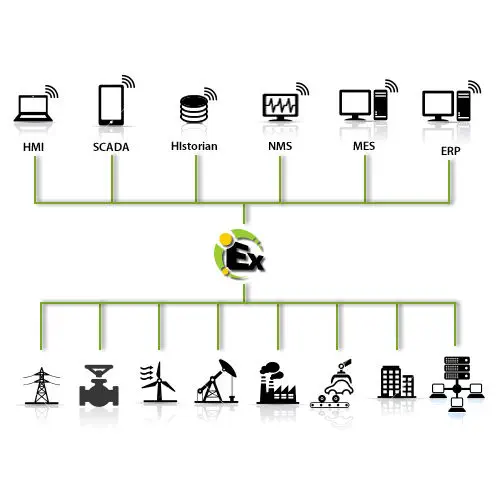

# 什么是Kepserver

Product Overview KEPServerEX is the industry’s leading connectivity platform that provides a single source of industrial automation data to all of your applications. The platform design allows users to connect, manage, monitor, and control diverse automation devices and software applications through one intuitive user interface. KEPServerEX leverages OPC (the automation industry’s standard for interoperability) and IT-centric communication protocols (such as SNMP, ODBC, and web services) to provide users with a single source for industrial data. The platform is developed and tested to meet our customers’ performance, reliability, and ease-of-use requirements. Watch our two-minute video below to see how KEPServerEX solves common connectivity challenges—providing secure and reliable access to real-time industrial data so everyone from the shop floor to the top floor can make smarter decisions. Business Value KEPServerEX provides the connectivity, usability, and performance required by the modern enterprise—offering competitive benefits that can be experienced from the plant floor to IT to the boardroom. IoT-ready, connecting Operations with IT and enabling Business Intelligence and Operational Excellence across the enterprise Fully compatible with the ThingWorx Manufacturing Accelerator, including the ThingWorx Controls Advisor app that provides remote real-time visibility into connectivity across all factories Compatible with leading hypervisors, such as VMware and Hyper-V, for flexible deployment on public and private clouds Integrates with IT applications for visibility into assets on the plant floor at any time and from any location

1. Kepserver提供了很多驱动，可以很方便的和现场各种各样的设备通讯
2. 同时呢，它可以作为一个数据仓库，不同的应用都从这一个仓库去和设备通讯 
3. Kepserver的Datalogger可以很方便的把历史数据存到数据库里面

