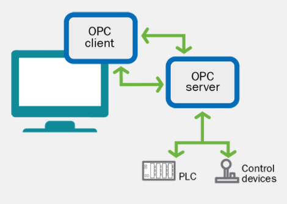
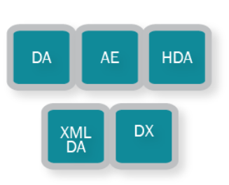
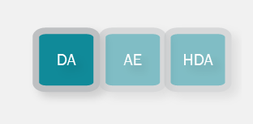
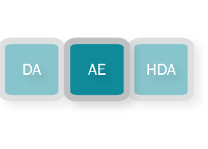
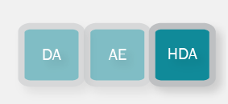
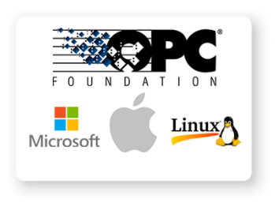
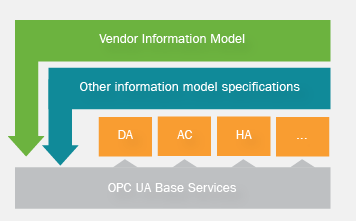
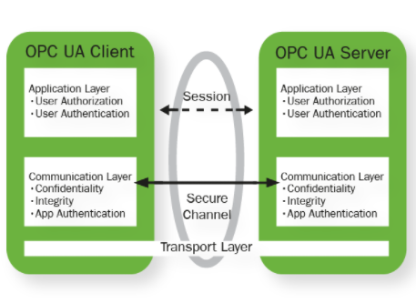
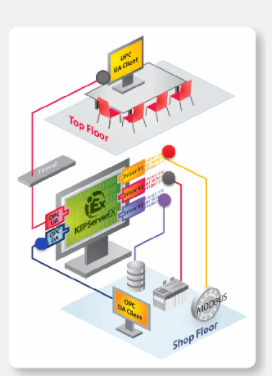

# OPC与OPC UA：从OPC到OPC UA

参考链接：

[OPC and OPC UA explained](https://www.novotek.com/uk/solutions/kepware-communication-platform/opc-and-opc-ua-explained/)

[维基百科-开放平台通信](https://zh.wikipedia.org/wiki/%E5%BC%80%E6%94%BE%E5%B9%B3%E5%8F%B0%E9%80%9A%E4%BF%A1)

## OPC

**开放平台通信**（Open Platform Communications）简称**OPC**，旧称“用于[过程控制](https://zh.wikipedia.org/wiki/过程控制)的[OLE](https://zh.wikipedia.org/wiki/对象链接与嵌入)”，是用于[工业自动化](https://zh.wikipedia.org/wiki/自动化)的一种通信标准。设备制造商（特别是[PLC](https://zh.wikipedia.org/wiki/可编程逻辑控制器)）如果遵从这一标准，则实时数据可提供给OPC Server，上位机的软件（称为OPC Client）直接访问OPC Server就可以获取到设备数据，从而对不同的设备的差异透明化。

1996年首次发布后，由[OPC基金会](https://zh.wikipedia.org/w/index.php?title=OPC基金会&action=edit&redlink=1)维护这一标准。[[1\]](https://zh.wikipedia.org/wiki/开放平台通信#cite_note-1) 2011年名字从“用于过程控制的OLE”改为“开放平台通信”，[[2\]](https://zh.wikipedia.org/wiki/开放平台通信#cite_note-2)以反映OPC已经从过程控制领域推广到[智能建筑](https://zh.wikipedia.org/wiki/智能建筑)、[离散制造](https://zh.wikipedia.org/w/index.php?title=离散制造&action=edit&redlink=1)等。OPC也超出了传统的[OLE技术](https://zh.wikipedia.org/wiki/OLE)，采用了[.NET Framework](https://zh.wikipedia.org/wiki/.NET_Framework)、[XML](https://zh.wikipedia.org/wiki/XML)、OPC基金会的二进制编码TCP格式。

## OPC 起源与使用

开放平台通信（OPC）规范是以[微软](https://zh.wikipedia.org/wiki/微軟)所开发，针对[Microsoft Windows](https://zh.wikipedia.org/wiki/Microsoft_Windows)操作系统下的[对象链接与嵌入](https://zh.wikipedia.org/wiki/对象链接与嵌入)（DDE）、[组件对象模型](https://zh.wikipedia.org/wiki/组件对象模型)（COM）及[Distributed COM](https://zh.wikipedia.org/wiki/Distributed_COM)（DCOM）技术为基础。规格定义了过程控制及工厂自动化需要的[对象](https://zh.wikipedia.org/wiki/对象_(计算机科学))、[接口](https://zh.wikipedia.org/wiki/介面_(資訊科技))及[方法](https://zh.wikipedia.org/wiki/方法_(電腦科學))，目的是为了达到[互操作性](https://zh.wikipedia.org/wiki/互操作性)。最常见的OPC规范是读写实时资料用的[OPC资料访问](https://zh.wikipedia.org/w/index.php?title=OPC資料存取&action=edit&redlink=1)（OPC DA）。许多制造商提到OPC时，所指的其实就是OPC Data Access。OPC DA在初版发行起，已有三个主要的版本，所有版本都向后兼容。第一版OPC DA的客户端仍可以访问第三版OPC DA的服务器，各版本会增加机能，但原有的机能仍然要支持。不过若客户端允许资料写入，就不支持旧版的服务器，例如DA 3 相同的客户端不一定支持DA 1.0的服务器。

除了OPC DA规范外，OPC基金会也维护[OPC Historical Data Access](https://zh.wikipedia.org/w/index.php?title=OPC_Historical_Data_Access&action=edit&redlink=1)（OPC HDA）的规范。OPC DA访问的是实时的资料，OPC HDA允许访问及检索已存档的历史资料。

OPC基金会还维护OPC Alarms and Events的规范，定义警告及事件型式的消息信息，类似变量状态及状态管理的消息[[3\]](https://zh.wikipedia.org/wiki/开放平台通信#cite_note-3)。

## OPC 设计

开放平台通信的设计目的是提供Windows-based软件应用程序以及程序控制硬件共同的桥梁。规范中定义从车间楼层设备访问现场设备的一致性方法。不论资料的来源及类型如何，方法都是不变的。某一硬件设备的OPC服务器提供OPC Client访问资料的方式，和其他设备的OPC服务器提供的方式都是一样的。目的是为了减少硬件设计者、软件合作厂商、[SCADA](https://zh.wikipedia.org/wiki/SCADA)及[HMI](https://zh.wikipedia.org/wiki/用户界面)厂商花在处理这类问题，创建相关接口上的心力。只要硬件制造商针对其硬件设备开发了OPC服务器，他们的工作就已经完成，任何设备都可以访问其信息，只要SCADA制造商开发了OPC client，就可以访问OPC相同的硬件。

OPC服务器提供方法给许多不同的软件包（前提是这些软件要是OPC client），让程序控制设备（例如[PLC](https://zh.wikipedia.org/wiki/可编程逻辑控制器)、[DCS](https://zh.wikipedia.org/w/index.php?title=分散型控制系統&action=edit&redlink=1)）来访问资料。传统上，若软件需要从一个设备访问资料，需要撰写客制的界面（驱动程序）。OPC的目的就是定义共同的接口，只要开发一次，任何SCADA、人机界面或是电脑软件都可以用此接口访问资料。

OPC规格没有限制服务器提供哪些资料给程序控制设备。OPC服务器可以发送MCU的内部温度，也可以发送某一地区目前的温度。

只要某个设备已经有了OPC服务器，其他可以作为OPC client的软件就可以访问此一设备。OPC服务器使用微软的OLE技术（也称为组件对象模型，COM）来和client通信。COM技术提供在软件应用程序以及程序硬件之间即时的资料交换。

OPC规范中有一些已经出版发行，其他一部分只开放给OPC协会的成员，没有一家公司拥有OPC规范，任何一家公司就算不是OPC协会的成员，也可以开发OPC服务器，非成员不一定要使用到最新的规范。任何人都可以集成OPC产品，系统集成商也不需要属于任何组织。每家需要OPC产品的公司可以自行决定其产品是否要经过认证，其系统集成商是否有需要接受必要的训练。

## OPC Fundamentals（OPC的基本原则）

OPC stands for OLE for Process Control which clearly shows that it comes out of the Microsoft community, based on the OLE and DCOM technology. **OPC is a Client/Server based communication** which means that you have one or more servers that waits for several Clients to make requests. Once the server gets a request it answers to that and then goes back into wait state. But the client can also instruct the Server to send updates when such comes in to the server. In OPC it’s the client that decides when and what data the server will fetch from the underlying systems. That is also true if the client subscribe to updates where the client decides how often the server should quire the systems.

## OPC Protocols or types

The different classical OPC protocols are completely self-sustained and have nothing in common. That means that the quality field in DA have no connection to the same field in HAD. Currently in the classic OPC model you have the following protocols; **DA** (Data access), **AE** (Alarm & Events), **HDA** (Historical Data Access), **XML** **DA** (XML Data Access) and finally **DX** (Data eXchange). Each of these protocols have their own read, write, etc. commands that only affect one protocol at the time. That is true even if one OPC server supports several of the protocols. The most commonly used and oldest protocol is the data access (DA) and in the following sections that and the others will be more explained.

## OPC Data Access

The most basic protocol of the OPC stack is the Data Access protocol that gets data out of the control systems into other systems on the shop floor. Each information about a specific tag or data point contains some information about it. First you have the data itself and that is called **Value** and of course the **Name** of it. To that comes a number of other pieces of information that describes the information, the first is the **Timestamp** that gives you the exact time when the value was read. This timestamp can be taken either directly from the underlying system or assigned to it when the data is read in the OPC server. The last piece is called **Quality** which gives a basic understanding if the data is valid or not. 

## OPC Alarm & Events

The second protocol to be added to the OPC stack was Alarms & Events. This protocol is fundamentally different from the DA protocol simply due to the fact that events not have a current value. This means that this protocol always is a subscription based service where the clients gets all the events that comes in. In terms of data that comes with the event there is no tags and therefore not any name and quality but there is of course a **Timestamp**. But like in the case with DA there is no store in the server and once the event is transferred the server forgets it was ever there. 

## OPC Historical Analysis

The difference between DA, AE and HDA is that HDA contains historical data and you can call for a large amount of past data. The protocol therefore supports long record sets of data for one or more data points. It was designed to provide a unified way to get out and distribute historical data stored in SCADA or Historian systems **like OSI-PI or Historian from GE**. The protocol is not so widely used today and now the introduction of OPC UA makes it somewhat obsolete.

## OPC的未来在OPC UA

[OPC UA](https://zh.wikipedia.org/wiki/OPC_UA)（OPC Unified Architecture）已经有对应的规范，并且其早期Adopters版本已经部署并且进行测试。OPC UA可以用[Java](https://zh.wikipedia.org/wiki/Java)、[Microsoft .NET](https://zh.wikipedia.org/wiki/Microsoft_.NET)、[C语言](https://zh.wikipedia.org/wiki/C语言)实现，避免了早期OPC版本需要用[Microsoft Windows](https://zh.wikipedia.org/wiki/Microsoft_Windows)为基础的系统才能实现的问题。UA结合了现有OPC接口的功能，又加入了像[XML](https://zh.wikipedia.org/wiki/XML)及[Web Services](https://zh.wikipedia.org/wiki/Web_Services)等技术，来支持高端的[制造执行系统](https://zh.wikipedia.org/wiki/制造执行系统)（MES）及[企业资源计划](https://zh.wikipedia.org/wiki/企业资源计划)（ERP）等应用。

OPC组织和[MTConnect](https://zh.wikipedia.org/w/index.php?title=MTConnect&action=edit&redlink=1)组织在2010年9月16日宣布会彼此合作，让两个标准之间有一致性及[互操作性](https://zh.wikipedia.org/wiki/互操作性)[[4\]](https://zh.wikipedia.org/wiki/开放平台通信#cite_note-4)。

## OPC UA

**OPC UA**的全名是OPC Unified Architecture（OPC统一架构）。是[OPC基金会](https://zh.wikipedia.org/w/index.php?title=OPC基金會&action=edit&redlink=1)应用在[自动化技术](https://zh.wikipedia.org/wiki/自动化技术)的[机器对机器](https://zh.wikipedia.org/wiki/機器對機器)[网络传输协议](https://zh.wikipedia.org/wiki/网络传输协议)。有以下的特点：

- 着重在资料收集以及控制为目的的通讯，用在工业设备以及系统中
- [开源标准](https://zh.wikipedia.org/wiki/开源标准)：标准可以免费取得，实作设备不需授权费，也没有其他限制
- [跨平台](https://zh.wikipedia.org/wiki/跨平台)：不限制操作系统或是编程语言
- [面向服务的架构](https://zh.wikipedia.org/wiki/面向服务的架构)（SOA）
- 强健的[信息安全](https://zh.wikipedia.org/wiki/信息安全)特性
- 整合的[信息模型](https://zh.wikipedia.org/wiki/信息模型)，是资讯整合中，基础设施的基础，制造商以及组织可以将其复杂的资料在OPC UA命名空间上建模，利用OPC UA面向服务的架构的优点。

## 创新：从OPC到OPC UA

开放平台通信（OPC）和COM/[DCOM](https://zh.wikipedia.org/wiki/Distributed_COM)的结合虽让开放平台通信可以顺利推展，但有以下的缺点：

- 频繁配置DCOM的问题
- 没有可以规划的逾时机能
- 只适用于[Microsoft Windows](https://zh.wikipedia.org/wiki/Microsoft_Windows)
- 资料安全性较低
- 没有针对DCOM的控管（COM/DCOM类似黑盒子，开发者无法取得源代码，因此需要处理一些相关的问题或是未充份实现的问题）

因为这些缺点以及许多其他的考虑因素，使得OPC基金会决定开发一个针对全新而且独立的OPC UA通讯协定栈来取代COM/DCOM。其优点有：

- 多平台实现，包括便携式的[ANSI C](https://zh.wikipedia.org/wiki/ANSI_C)、[Java](https://zh.wikipedia.org/wiki/Java)及[.NET框架](https://zh.wikipedia.org/wiki/.NET框架)。
- 可扩展性，从[智能传感器](https://zh.wikipedia.org/w/index.php?title=智能傳感器&action=edit&redlink=1)、智能致动器一直到大型计算机。
- 支援[多线程](https://zh.wikipedia.org/wiki/多线程)，也有单线程/单任务的模式，以便将此通讯协定栈放在[嵌入式系统](https://zh.wikipedia.org/wiki/嵌入式系统)中。
- 基于新标准的资料安全性
- 每个设备都有可以规划的逾时机能
- 大容量资料报文的组块

通讯协定栈反映了架构创新的基础，OPC UA架构是[面向服务的体系结构](https://zh.wikipedia.org/wiki/服務導向架構)（SOA），以许多不同逻辑层级为其基础。

OPC基础服务是抽象形别的叙述，和通讯协定无关，是OPC UA机能的基础。传输层将方法转换为通讯协定，将资料[序列化](https://zh.wikipedia.org/wiki/序列化)（或反序列化），再传送到网络上。 为了上述目的，定义了两种[通讯协定](https://zh.wikipedia.org/wiki/通訊協定)，其中一个是以效率进行过最佳化的二进制[TCP](https://zh.wikipedia.org/wiki/传输控制协议)讯定，另一个则是[Web服务](https://zh.wikipedia.org/wiki/Web服务)导向的协定。

OPC资讯模型是所谓的全网状网络（Full Mesh Network），以[节点](https://zh.wikipedia.org/wiki/节点_(电信网络))为基础。节点类似[面向对象程式设计](https://zh.wikipedia.org/wiki/物件導向程式設計)（OOP）中的[物件](https://zh.wikipedia.org/wiki/物件_(電腦科學))，可以包括各种的元资料。节点可以有属性让其他设备读取（DA、HDA），有方法可以呼叫（Commands），也有可以启动传输的触发事件（AE、DataAccess、DataChange）。节点包括过程资料，也包括其他种类的元资料。OPC命名空间中包括了形态模型。

客户端软件可以确认服务器支援哪些行规（profile），有需要获得这些资讯，知道服务器是否只支援DA，或是还支援AE和HDA。而且可以得到服务器是否支援特定行规的讯息。OPC UA还有以下重要的新机能：

- 支援冗余（Redundancy）
- 双方向连结的心跳报文（Heartbeat）（确定另外一端是否“活着”），这表示客户端和服务器都可以识别中断。
- 传输资料及acknowledgement的缓冲（Buffering），连结遗失不会造成资料遗失，可以重新获取之前遗失的资料报文。

OPC UA 是在2006年10月在慕尼黑举行的 OPC UA DevCon 中首次公开其协定，在[Beckhoff](https://zh.wikipedia.org/wiki/Beckhoff) 的 PLC 上已有许多的 UA 服务器，在 Euros 嵌入式测试电路板中也有UA服务器。Beckhoff PLC 的底层是 Windows XP嵌入式系统，而嵌入式控制器执行的操作系统是[实时操作系统](https://zh.wikipedia.org/wiki/实时操作系统) Euros。Embedded Labs Ltd 公司在他们执行在单芯片ARM控制器（64kb RAM） C++ UA Stack 上展示了 OPC-UA。2012年10月时德国的 Fraunhofer-Application Center IOSB-INA 以及工业信息技术研究所（Institute for industrial Information Technologies, inIT）证实了OPC-UA服务器可以只使用15 kB RAM以及10 kB ROM，因此是芯片等级可以使用的通讯架构[[2\]](https://zh.wikipedia.org/wiki/OPC_UA#cite_note-2)。

## 通讯协定

OPC UA支援两种通讯协定[[3\]](https://zh.wikipedia.org/wiki/OPC_UA#cite_note-3)，这两种通讯协定的差异只有URL的不同，二进制通讯协定是**opc.tcp://Server**，而Web服务的通讯协定是**http://Server**，其他情形下，OPC UA对[应用程序接口](https://zh.wikipedia.org/wiki/应用程序接口)的作业完全透明，其他作业不受OPC UA的影响。

二进制通讯协定的效率最高，其overhead也最少，让需要的资源最小化（不需要XML解析器、[SOAP](https://zh.wikipedia.org/wiki/簡單物件存取協定)及[HTTP](https://zh.wikipedia.org/wiki/超文本传输协议)，对嵌入式系统格外重要），提供最佳的互操控性（在实现时，二进制通讯协定提供较少的自由度），使用任意选取的TCP通道，可以较容易的进行[隧道协议](https://zh.wikipedia.org/wiki/隧道协议)，也可以从透过防火墙开启。

Web服务（SOAP）通讯协定可以支援许多不同的工具（包括Java环境或是.NET环境的工具），使用标准HTTP(S)埠，可以和防火墙共同使用。

所有的实现方式都支援二进制通讯协定，但只有用.NET实现的设备才支援SOAP。

## 最重要的意义从OPC到OPC UA

The most significant difference between classical OPC and OPC UA is that it doesn’t rely on OLE or DCOM technology from Microsoft that makes it possible to implement it on any platform if that being Apple, Linux (JAVA) or Windows. The other very important part of UA is the possibility to use structures or models. This means that the data tags or points can be grouped and be given context which make governance and maintenance much easier. These models can be identified in runtime which makes it possible for a client to explore connection possible by asking the server.

## OPC UA Information Modelling

The information modelling is very modern in OPC UA. These models can be defined by manufactures or protocols like BACNet but it can also contain more of a **MESH structure** where very complex relations and connections between points and nodes can be defined. The possibility also exist to have data structures so that certain data always is grouped and handled as one piece. This is important in many applications where you want to be sure that the data set is taken at the same time.

## OPC UA Communication layers

OPC UA is as said before built to be platform independent and the communication is built into layers on top of the standard TCP/IP stack. Above the standard transport layers there are two layers, one that handles the session and one to establish a secure channel between the client and server. The transport layer is made up of **TCP/IP and on top of that SSL, HTTP or HTTPS**. The Communication layer secure the communication channel not just that the data is corrupted but also it secure the authentication so that the end points can’t be infiltrated and changed. This is based on **X.509 certificates** that have three parts to it and the first peer to peer trust needs to be manually done but after that the rest is taken care of securely.

## Applications with OPC UA

So far OPC UA are mostly used for bridging between different OPC servers, this is called tunneling. This is something that for example **KEPServerEX OPC UA** tunnel does. Other applications include the **GE Global discovery server** and the same control system that have full OPC UA support for browsing the data structures. This is still quite uncommon but the development goes fast and there is a lot of work done in order to include data models for transferring models from **BACNet, ISA95 and PLCopen**. 

