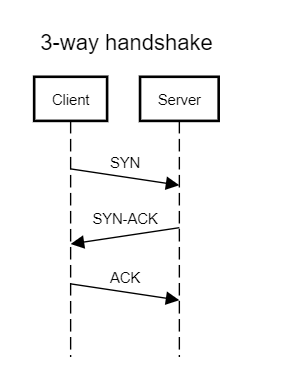
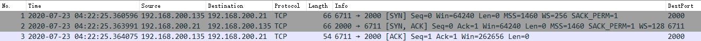
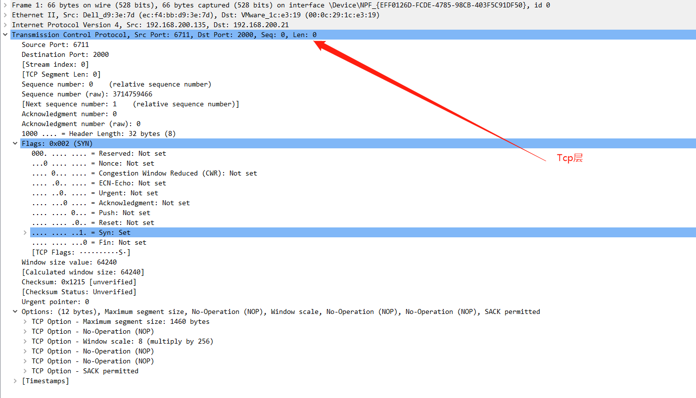
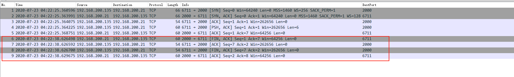

# Tcp

tcp 是 Transmission **C**ontrol **P**rotocol的缩写，传输控制协议

## 建立连接

tcp通信时建立在连接的基础上的，也就是说，他一定要建立连接以后，才可以发送数据

## 最开始是三次握手：

1. 客户端发送SYN（synchronization）包到服务器，表示，我想要和你连接，并且等待服务器返回
2. 服务器返回一个ACK（acknowledgment ）和SYN到客户端，表示，我可以和你连接
3. 客户端把服务器返回的ACK再返回给服务器，表示这次连接成功建立

## 抓包如下：

## 包分析：

## 

* Source Port : 谁发了这个包

* Destination Port 发给谁的包

* [Stream index: 0]：加了大括号的都不是包原有的内容，是Wireshark加上去的，方便我们理解的参数，这个参数是方便wireshark追踪的，具体看下面这个老外的解释。This is not a real TCP parameter. It’s only a Wireshark representation of the connection 4 values (source address, source port, destination address, and destination port). If one of these values changed, the sequence number will differ. This can happen for example if you are capturing at the server-side and there is more than one client connected to the server, then each connection will have its sequence number.

* [TCP segment length]：这个包含有多少个数据

* Sequence number ：  This is a Wireshark more readable representation of the sequence number. It’s calculated starting from 0, so it’s easier to track packets.

* Sequence number (raw)：The actual sequence number sent on the packet — the one starts from the **ISN**（ISN是initial sequence number的缩写，初始化的时候，客户端和服务器都会发一个这玩意，ISN初始化值不是0，客户端和服务端两边发的还不一样。具体怎么算出来的可以百度）

* Next sequence number: Normally it’s the current sequence number + the length of data in the current packet. This rule doesn’t apply to this packet as it’s a **SYN** packet, and the **SYN** is considered as 1 byte, so the next sequence number increased by 1 seven if there is no data on the packet.

- Acknowledgment number: This represents the total number of bytes the current transmitting host received from the other side. This field is also a Wireshark added field to make it easier to analyze the TCP capture by counting the acknowledgment number from 0.
- Acknowledgment number (raw): The real Acknowledgment number.
- Header length: The TCP header length. This can range from 20 to 60 bytes depending on the TCP options in the packet.

- Window size value: This is the receive buffer size in the current transmitting host. The host here is informing the other side host how many bytes it can receive to avoid the case of the other side replying with a large number of bytes that can’t be handled.
- Checksum: Checksum of the TCP packet. This is used by the receiving host to verify that the received packet is OK
- Checksum status: By default Wireshark is not verifying the packet checksum, but there is an option to enable checksum verification.

### tcp flags

- Congestion window reduced: The transmitting host reduced its transmit rate
- ECN-Echo: the transmitting host received an earlier congestion notification
- Urgent: Flag the packet as an urgent to inform the OS to handle it in a higher priority
- Acknowledgment: This flag indicates if the current packet contains an **ACK**
- Push: The receiving host should pass the data to the receiving APP as soon as possible.
- Reset: Indicates that the connection has some problem and it’s reset from the transmitting host side.
- Syn: Indicates that this packet is a **SYN** packet
- Fin: Indicate that this is a finalization **FIN** packet. Will see this later when talking about closing the TCP connection.

### TCP options

TCP options are used to add capabilities that were not part of the original TCP specifications. We will not discuss options now as they will be discussed later.

### 如果服务器没有和客户端连接的情况

The client connection to the server can be refused and the most common causes are that the server is not listening on the port the client is trying to connect to or if there is some firewall rule that prevents the connection. In this case, the server may respond with a **reset** instead of **SYN** and **ACK**

### 关闭连接

客户端可以主动断开连接，服务器也可以主动断开连接。

To close the TCP connection, the closing side should send a **FIN** packet which also contains an **ACK** for the last data this side received, then the other side should reply with an **ACK** that it received the **FIN** and notify the application that the other side is closing the connection. Usually, the application will close the connection too which leads to another **FIN** to be sent to the side initiate the close, and wait for an **ACK** to know that connection is now closed completely from both sides.
This is the TCP connection close sequence diagram assuming that the client initiated the connection termination

The side that initialized the connection closure will not be able to use the same IP and local port again to connect to the same server IP and port for a certain period — controlled by the operating system. It should wait for some timeout counter set by it’s OS to timeout before being able to do so.

If any problems happened during the connection close, then the connection may be terminated with a **Reset** instead of **FIN**.

There is also a half-closed mode, in which only one side closes the connection to indicate that it will not transmit any more, but it can normally receive data from the other side till it closes the connection too.