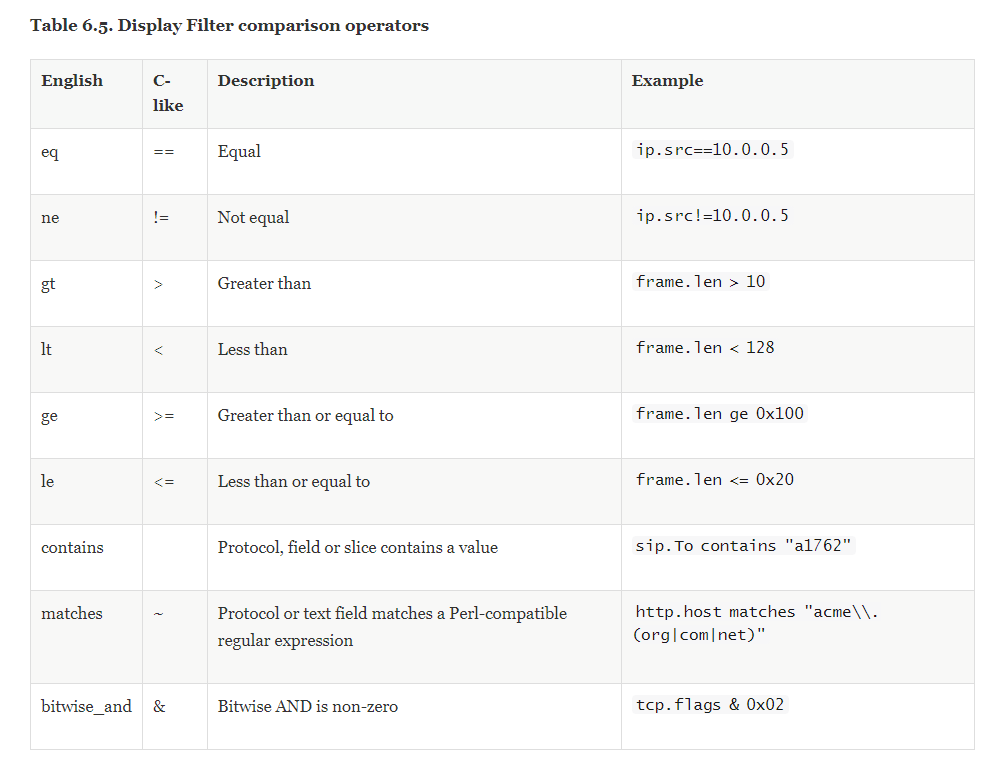
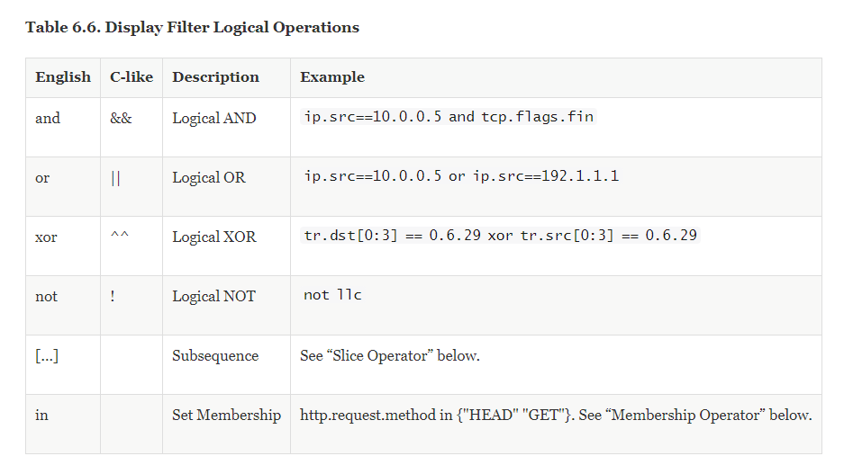
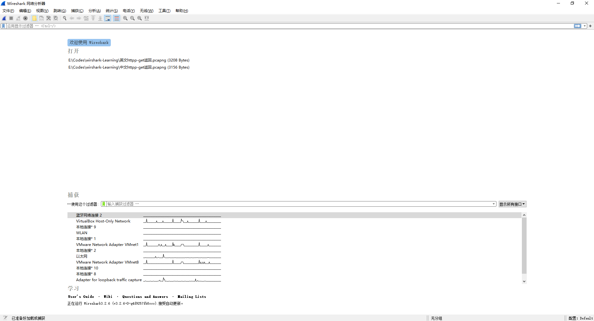
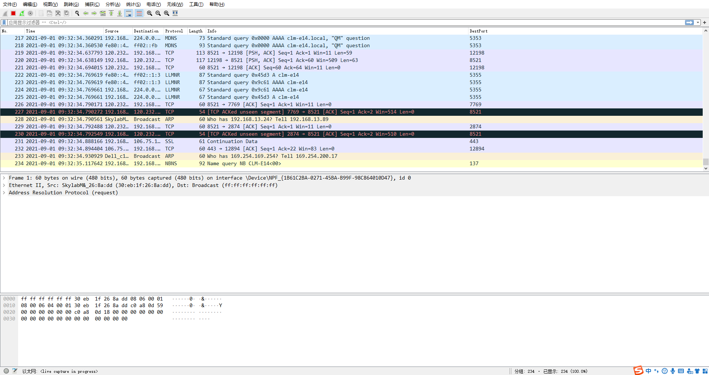
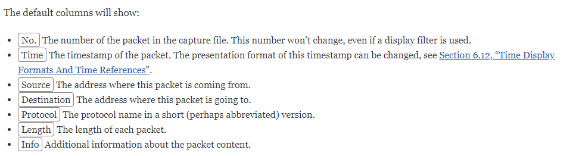
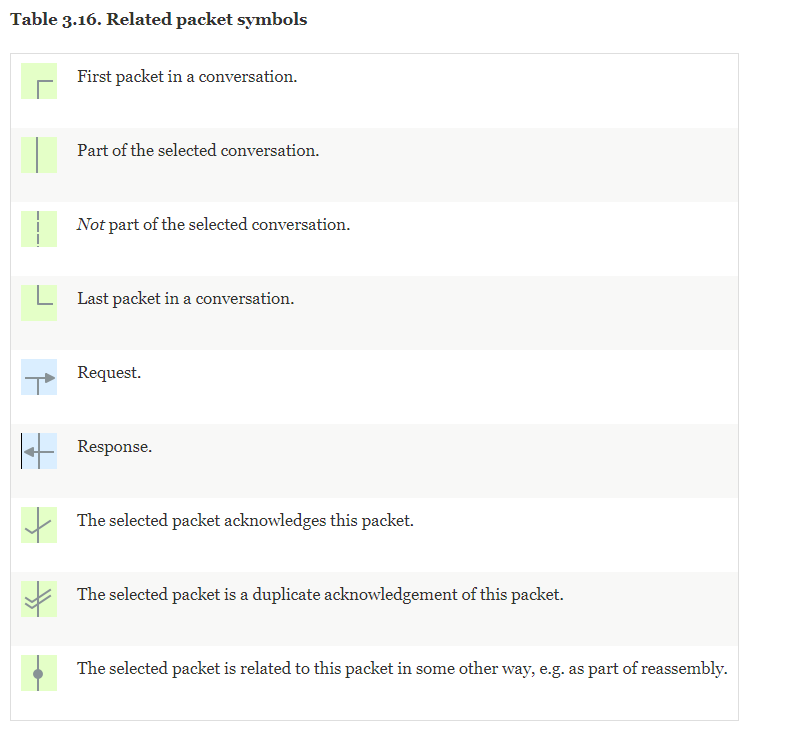
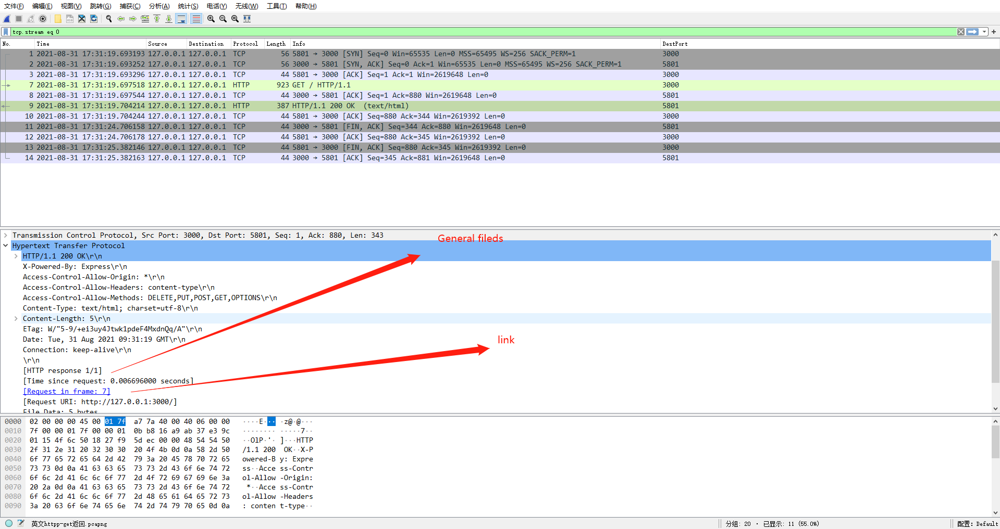
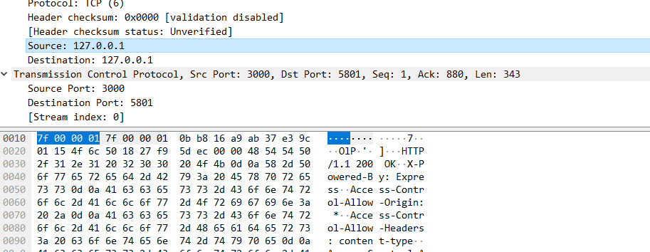
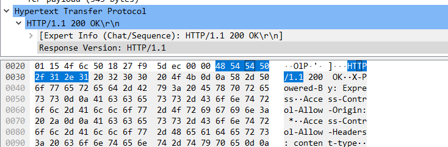

#  Wireshark的使用

## 下载

可以去官网下载，也可以百度一个绿色免安装的

## 官方文档位置

官网进去，右上角Get Help -> Documentation -> User's Guide

[官方文档](https://www.wireshark.org/docs/wsug_html_chunked/)

## wireshark捕获到的例子下载

[[SampleCaptures](https://wiki.wireshark.org/SampleCaptures)](https://wiki.wireshark.org/SampleCaptures#TCP)

## 快捷键

## 过滤器

**wireshark的过滤项是“协议“+”.“+”协议字段”的模式**

还有一些高级技巧，具体可以参考官方文档：[过滤器文档](https://www.wireshark.org/docs/wsug_html/#ChAdvShowPacketBytes)

## 捕获过滤器

百度搜 [捕获过滤器语法](https://www.baidu.com/s?ie=UTF-8&wd=%E6%8D%95%E8%8E%B7%E8%BF%87%E6%BB%A4%E5%99%A8%E8%AF%AD%E6%B3%95)

捕获开始之前的过滤

捕获过滤器表达式没有像显示过滤器表达式那样明显的规律，但写法不多所以也不难；而且除非全部捕获要占用的磁盘空间实现太大，且你非常明确过滤掉的数据包是你不需要的，不然一般都不用捕获过滤器表达式而用显示过滤器表达式。

## 显示过滤器

针对捕获到的数据的过滤

* 目标IP地址过滤：ip.dst == 192.168.13.42

## 基本使用

### 打开后基本上是这个样子的

### 捕获下面有网卡选项，选择要捕获的网卡

我选择以太网，双击它，然后就会出现WireShark的主页面

这个窗口，可以看到分为上中下，三个小的内置窗口，分别是：

1. 显示所有捕获到的帧  Packet List
2. 点击每一帧，分不同的层  Packet Details
3. 每一帧的原始Byte数组  acket Bytes

### Packet List

Tips：选中每一帧有一个追踪流，这个功能比较好用

### Packet Details

- **Generated fields.** Wireshark itself will generate additional protocol information which isn’t present in the captured data. This information is enclosed in square brackets (“[” and “]”). Generated information includes response times, TCP analysis, IP geolocation information, and checksum validation.
- **Links.** If Wireshark detects a relationship to another packet in the capture file it will generate a link to that packet. Links are underlined and displayed in blue. If you double-clicked on a link Wireshark will jump to the corresponding packet. 

数字：16进制转换成10进制，比如127.0.0.1，在下面是7f 00 00 01

字母要参照Ascall码表（不同的协议用到的字符集不一样，这个Http，用的是utf-8，所以直接查Ascall表就行了）

