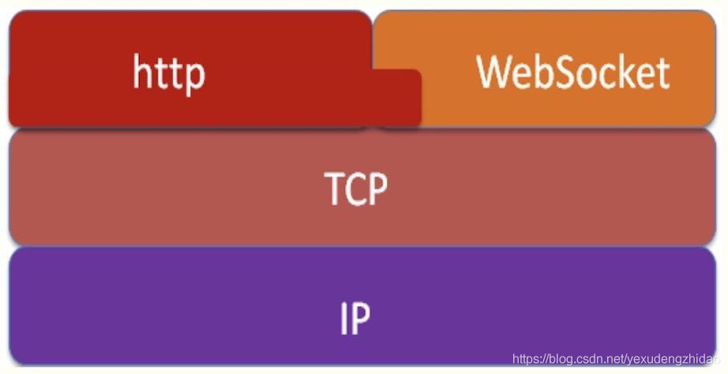

# websocket

[websocket的实现和应用](https://blog.csdn.net/yexudengzhidao/article/details/92846600)

### 什么是WebSocket?

​    WebSocket是HTML5中的协议，支持持久连接，http协议不支持持久性连接（长连接，循环连接的不算）。Http1.0和HTTP1.1都不支持持久性的链接，HTTP1.1中的keep-alive，将多个http请求合并为1个，也就是不用再去重复建立TCP连接了。

### WebSocket是什么样的协议，具体有什么优点？

​    HTTP的生命周期通过Request来界定，也就是Request一个Response，那么在Http1.0协议中，这次Http请求就结束了。在Http1.1中进行了改进，是有一个connection：Keep-alive字段，也就是说，在一个Http连接中，可以发送多个Request，接收多个Response。但是必须记住，在Http中一个Request只能对应有一个Response，而且这个Response是被动的，不能主动发起。

WebSocket是基于Http协议的，或者说借用了Http协议来完成一部分握手，在握手阶段与Http是相同的。我们来看一个websocket握手协议的实现，基本是2个属性，upgrade，connection。

基本请求如下：

```
GET /chat HTTP/1.1
Host: server.example.com
Upgrade: websocket
Connection: Upgrade
Sec-WebSocket-Key: x3JJHMbDL1EzLkh9GBhXDw==
Sec-WebSocket-Protocol: chat, superchat
Sec-WebSocket-Version: 13
Origin: http://example.com
```

多了下面2个属性：

```
Upgrade:webSocket
Connection:Upgrade
```

这个就是Websocket的核心了，告诉 Apache 、 Nginx 等服务器：注意啦，我发起的是Websocket协议，快点帮我找到对应的助理处理~不是那个老土的HTTP。

```
Sec-WebSocket-Key: x3JJHMbDL1EzLkh9GBhXDw==
Sec-WebSocket-Protocol: chat, superchat
Sec-WebSocket-Version: 13
```

首先， Sec-WebSocket-Key 是一个 Base64 encode 的值，这个是浏览器随机生成的，告诉服务器：泥煤，不要忽悠窝，我要验证尼是不是真的是Websocket助理。

然后， Sec_WebSocket-Protocol 是一个用户定义的字符串，用来区分同URL下，不同的服务所需要的协议。简单理解：今晚我要服务A，别搞错啦~

最后， Sec-WebSocket-Version 是告诉服务器所使用的 Websocket Draft （协议版本），在最初的时候，Websocket协议还在 Draft 阶

段，各种奇奇怪怪的协议都有，而且还有很多期奇奇怪怪不同的东西，什么Firefox和Chrome用的不是一个版本之类的，当初Websocket

协议太多可是一个大难题。。不过现在还好，已经定下来啦，大家都使用的一个东西。

### 3. Websocket的作用

在讲Websocket之前，我就顺带着讲下 ajax轮询和long poll 的原理。

#### 1. Ajax轮询怎么实现的？

其实，这个大多数小伙伴都知道了，ajax轮询模拟长连接就是每隔一段时间（0.5s）就向服务器发起ajax请求，查询服务器端是否有数据更新。

客户端：有没有新消息
　　服务器端：没有。。（第一次http结束）
　　客户端：有没有新消息
　　服务器端：有，xxxxx （第二次http结束）
　　客户端：有没有新消息
　　服务器端：没有。。 （第三次http结束）
　　客户端：有没有新消息
　　服务器端：没有。。 （第四次http结束）
　　。。。。。。
　　其缺点显而易见，每次都要建立HTTP连接，即使需要传输的数据非常少，所以这样很浪费带宽；同时，这个过程是被动性的，即不是服务器主动推送的。

#### 2. 长连接（long pull）是如何工作的 ？

​			客户端：有没有新信息（Request）–第一次http请求开始
　　　服务端：没有信息，不作回应（时间一直的流逝。。。一直保持http连接， 当等到有消息的时候）
　        服务器端：给你xxxx（Response）–这时，第一次的http请求获得想要的结果，然后还要发起第二、三。。次http请求
　        客户端：有没有新消息（Request）–第二次http请求开始

　   。。。。。
　　其缺点也是显而易见的，同ajax轮询一样，也是每次都要建立HTTP连接，也都是被动的。而且这种方法对服务器的并行要求比较大，因为在没有消息的时候，连接照样保持，而这时需要其它信息是又要建立新的连接（就连接保持中）

#### Websocket怎么工作的

　	客户端：我要建立websocket连接
　　服务器端：好的，已经切换到websocket协议，websocket连接已经建立
　　客户端：有什么消息要及时告诉（推送）我
　　服务器端：好的
　　服务器端：xxxxxx
　　服务器端：yyyyyyy
　　。。。。。
　　其优点就是，只要建立一次连接，就可以连续不断的得到服务器推送的消息，节省带宽和服务器端的压力。

### 4. WebSocket与TCP，HTTP的关系

WebSocket与http协议一样都是基于TCP的，所以他们都是可靠的协议，调用的WebSocket的send函数在实现中最终都是通过TCP的系统

接口进行传输的。WebSocket和Http协议一样都属于应用层的协议，WebSocket在建立握手连接时，数据是通过http协议传输的，但是

在建立连接之后，真正的数据传输阶段是不需要http协议参与的。具体关系如下：



WebSocket使用了自定义的协议，未加密的连接不再是http://，而是ws://，默认端口为80，加密的连接也不是https://，而是wss://，默认端口为443。

### 5. websocket前后端通信

**前端：**

```html
<!DOCTYPE html>
<html>
    <head>
        <title>
        </title>
    </head>
    <body>
        <button id="btn">
            ajax请求
        </button>
        <button id="wsbtn">
            发送websock请求
        </button>
        <script type="text/javascript">
   //          let xhr = new XMLHttpRequest()
			// xhr.open('get', 'http://127.0.0.1:8000', true)
			// xhr.send()
			// xhr.onreadystatechange = function () {
			// 	if (xhr.readyState === 4) {
			// 		if (xhr.status === 200) {
			// 			console.log(xhr.responseText)
			// 		}
			// 	}
			// }
			let wsBtn = document.querySelector('#wsbtn')

			wsBtn.onclick = function() {
				// alert(1)
				const ws = new WebSocket('ws://127.0.0.1:8001')
				ws.onopen = function (e) {
					console.log('connection to server opened')
					ws.send('hello word')
				}
				

				ws.onmessage = function(event) {
					let data = event.data
					alert(data)

				}
			}
        </script>
    </body>
</html>
```

**后端：**

```js
const WebSocketServer = require('ws').Server
wss = new WebSocketServer({port: 8001})
wss.on('connection', function (ws) {
    console.log('client connected')
    ws.on('message', function (message) {
        console.log(message)
    })

})
```

