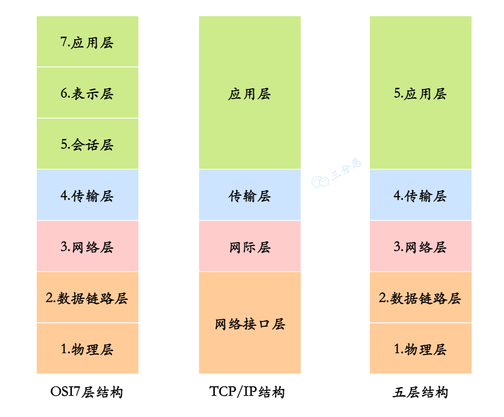
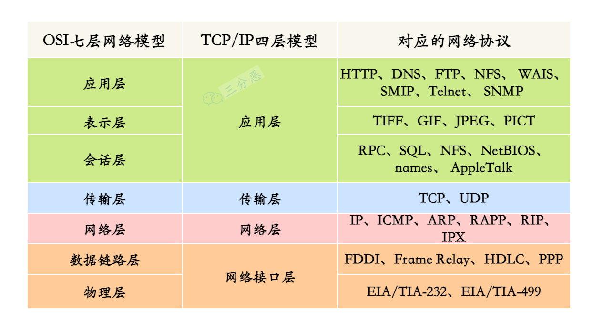
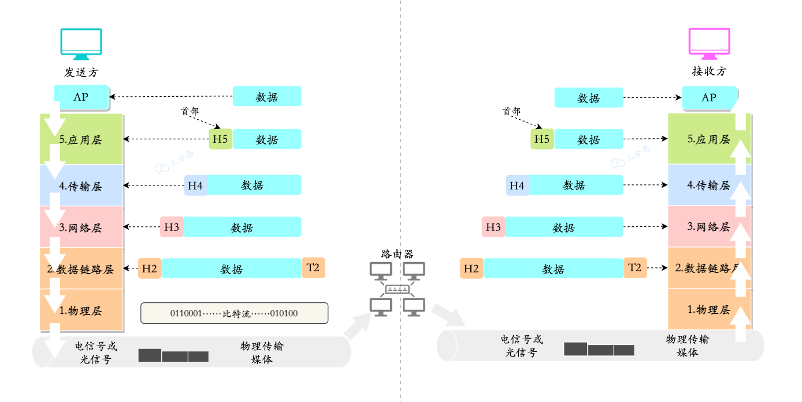
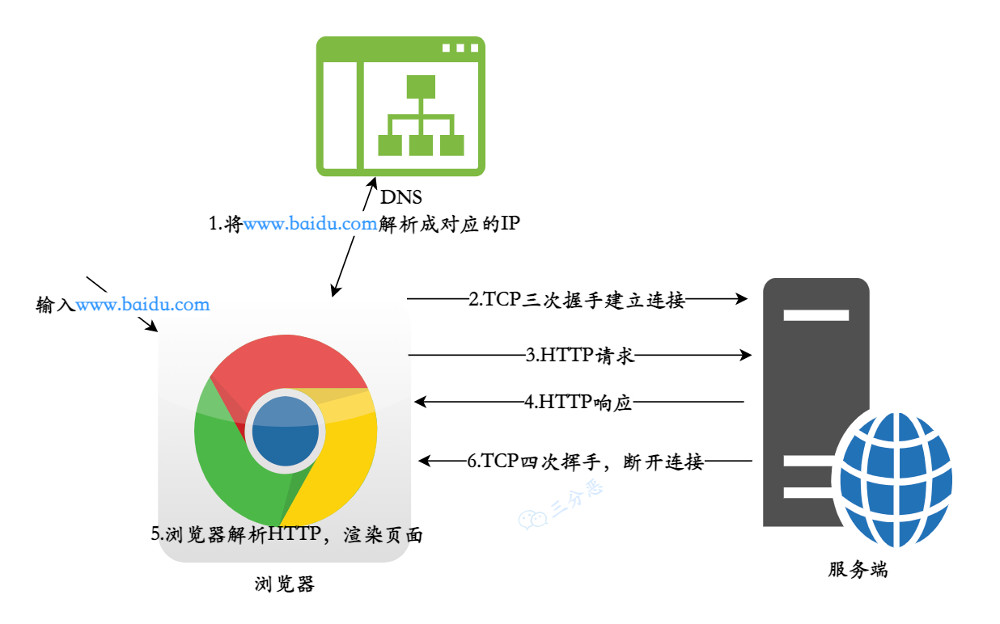
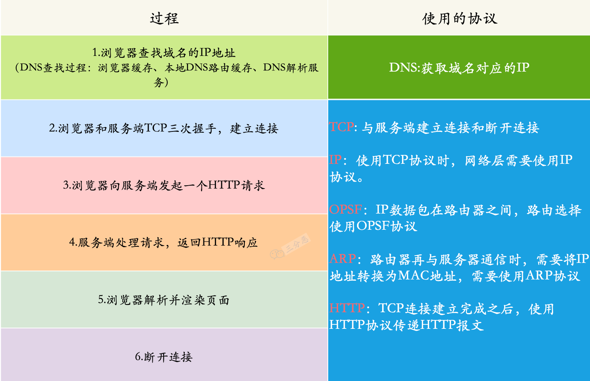
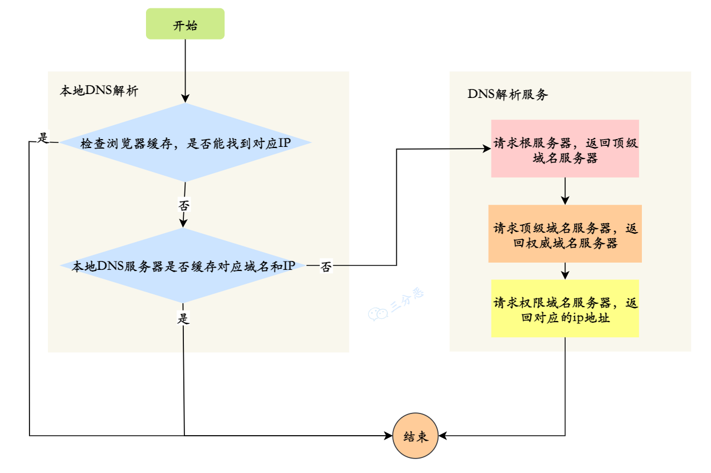
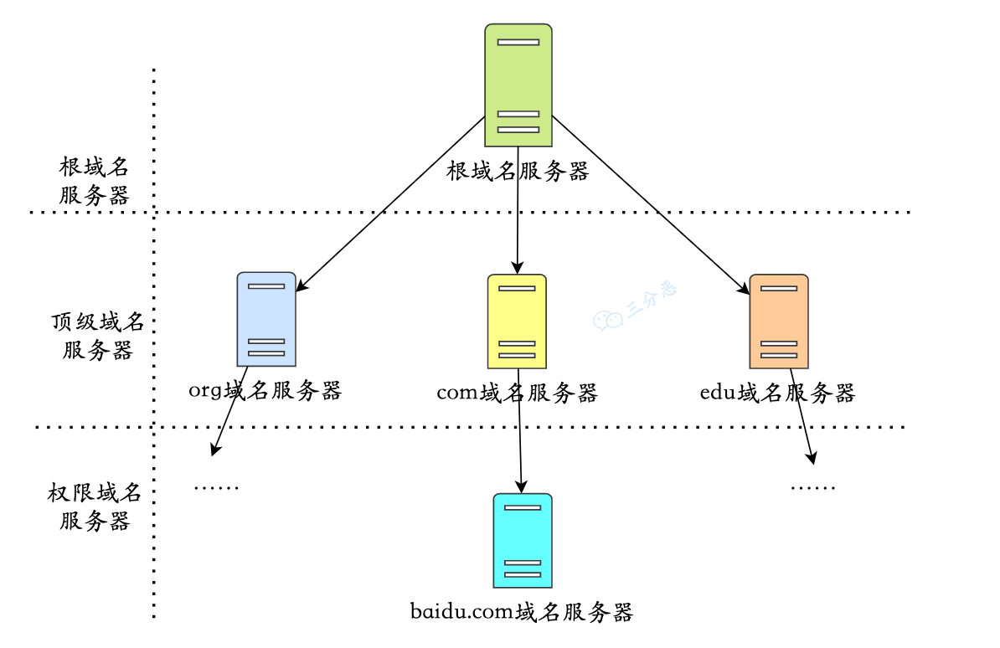
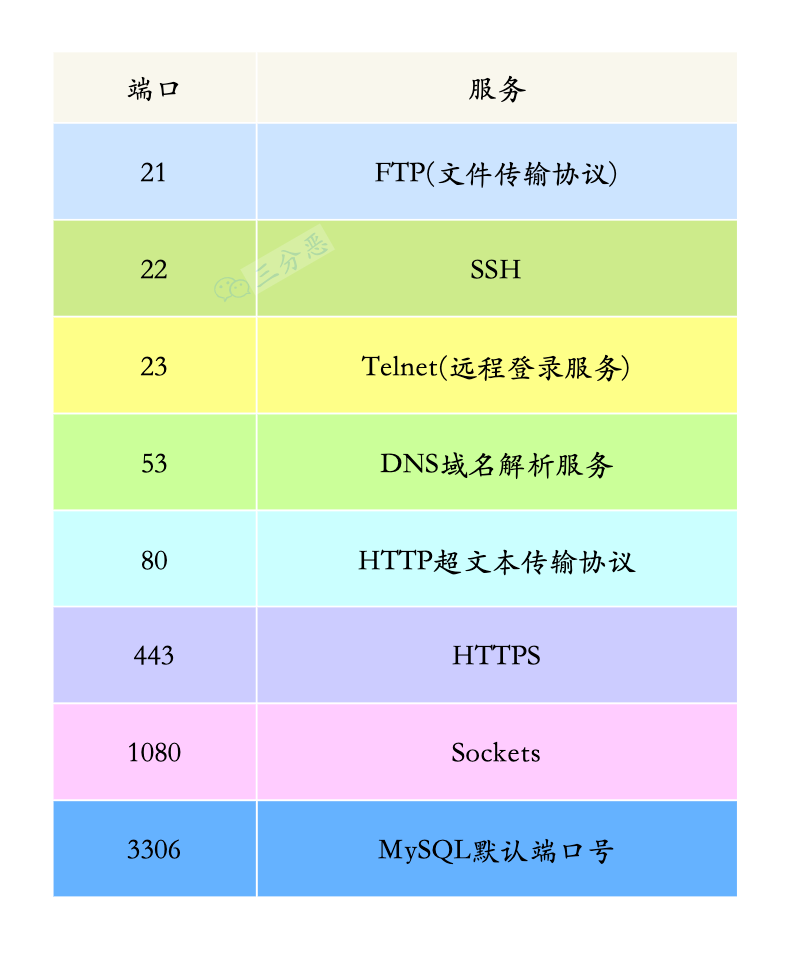

#  详解计算机网络62问

[csdn-详解计算机网络62问](https://blog.csdn.net/sinat_40770656/article/details/122814377?utm_medium=distribute.pc_feed_v2.none-task-blog-expert_recommend-1.pc_personrecdepth_1-utm_source=distribute.pc_feed_v2.none-task-blog-expert_recommend-1.pc_personrec)

# 基础

### 1.说下计算机网络体系结构

计算机网络体系结构，一般有三种：OSI 七层模型、TCP/IP 四层模型、五层结构。

简单说，OSI是一个理论上的网络通信模型，TCP/IP是实际上的网络通信模型，五层结构就是为了介绍网络原理而折中的网络通信模型。

**OSI 七层模型**

OSI 七层模型是国际标准化组织（International Organization for Standardization）制定的一个用于计算机或通信系统间互联的标准体系。

- 应用层：通过应用进程之间的交互来完成特定网络应用，应用层协议定义的是应用进程间通信和交互的规则，常见的协议有：HTTP FTP SMTP SNMP DNS.
- 表示层：数据的表示、安全、压缩。确保一个系统的应用层所发送的信息可以被另一个系统的应用层读取。
- 会话层：建立、管理、终止会话，是用户应用程序和网络之间的接口。
- 运输层：提供源端与目的端之间提供可靠的透明数据传输，传输层协议为不同主机上运行的进程提供逻辑通信。
- 网络层：将网络地址翻译成对应的物理地址，实现不同网络之间的路径选择, 协议有 ICMP IGMP IP 等.
- 数据链路层：在物理层提供比特流服务的基础上，建立相邻结点之间的数据链路。
- 物理层：建立、维护、断开物理连接。

**TCP/IP 四层模型**

- 应用层：对应于 OSI 参考模型的（应用层、表示层、会话层）。
- 传输层: 对应 OSI 的传输层，为应用层实体提供端到端的通信功能，保证了数据包的顺序传送及数据的完整性。
- 网际层：对应于 OSI 参考模型的网络层，主要解决主机到主机的通信问题。
- 网络接口层：与 OSI 参考模型的数据链路层、物理层对应。

**五层体系结构**

- 应用层：对应于 OSI 参考模型的（应用层、表示层、会话层）。
- 传输层：对应 OSI 参考模型的的传输层
- 网络层：对应 OSI 参考模型的的网络层
- 数据链路层：对应 OSI 参考模型的的数据链路层
- 物理层：对应 OSI 参考模型的的物理层。

### 2.说一下每一层对应的网络协议有哪些？

一张表格总结常见网络协议：

### 3.那么数据在各层之间是怎么传输的呢？

对于发送方而言，从上层到下层层层包装，对于接收方而言，从下层到上层，层层解开包装。

- 发送方的应用进程向接收方的应用进程传送数据
- AP先将数据交给本主机的应用层，应用层加上本层的控制信息H5就变成了下一层的数据单元
- 传输层收到这个数据单元后，加上本层的控制信息H4，再交给网络层，成为网络层的数据单元
- 到了数据链路层，控制信息被分成两部分，分别加到本层数据单元的首部（H2）和尾部（T2）
- 最后的物理层，进行比特流的传输

这个过程类似写信，写一封信，每到一层，就加一个信封，写一些地址的信息。到了目的地之后，又一层层解封，传向下一个目的地。

# 网络综合

### 4.从浏览器地址栏输入 url 到显示主页的过程？

这道题，大概的过程比较简单，但是有很多点可以细挖：DNS解析、TCP三次握手、HTTP报文格式、TCP四次挥手等等。

1. DNS 解析：将域名解析成对应的 IP 地址。
2. TCP连接：与服务器通过三次握手，建立 TCP 连接
3. 向服务器发送 HTTP 请求
4. 服务器处理请求，返回HTTp响应
5. 浏览器解析并渲染页面
6. 断开连接：TCP 四次挥手，连接结束

我们以输入www.baidu.com 为例：

各个过程都使用了哪些协议？

### 5.说说 DNS 的解析过程？

DNS，英文全称是 **domain name system**，域名解析系统，它的作用也很明确，就是域名和 IP 相互映射。

DNS 的解析过程如下图：

假设你要查询 **www.baidu.com** 的 IP 地址:

- 首先会查找浏览器的缓存,看看是否能找到**www.baidu.com**对应的IP地址，找到就直接返回；否则进行下一步。
- 将请求发往给本地DNS服务器，如果查找到也直接返回，否则继续进行下一步；

- 本地DNS服务器向根域名服务器发送请求，根域名服务器返回负责com的顶级域名服务器的IP地址的列表。
- 本地DNS服务器再向其中一个负责com的顶级域名服务器发送一个请求，返回负责baidu.com的权限域名服务器的IP地址列表。
- 本地DNS服务器再向其中一个权限域名服务器发送一个请求，返回www.baidu.com所对应的IP地址。

### 6.说说 WebSocket 与 Socket 的区别？

- Socket 其实就是等于 **IP 地址 + 端口 + 协议**。

  `具体来说，Socket 是一套标准，它完成了对 TCP/IP 的高度封装，屏蔽网络细节，以方便开发者更好地进行网络编程。`

- WebSocket 是一个持久化的协议，它是伴随 H5 而出的协议，用来解决 **http 不支持持久化连接**的问题。

- Socket 一个是**网编编程的标准接口**，而 WebSocket 则是应用层通信协议。

### 7.说一下你了解的端口及对应的服务？

###  

